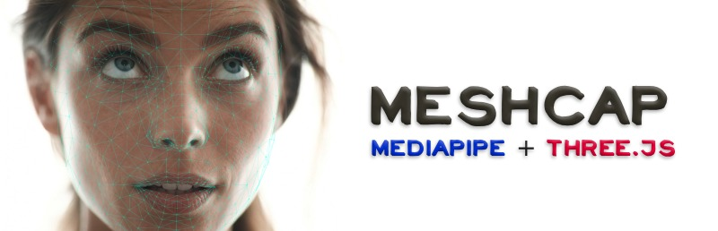

# Launch [MeshCap](https://bandinopla.github.io/three-mediapipe-rig/?editor=meshcap) 

#### Explore the demos: 
- [Loading .mcap files](https://bandinopla.github.io/three-mediapipe-rig/?demo=load-meshcap-files)
- [Clips with Audio: Memory game](https://bandinopla.github.io/three-mediapipe-rig/?demo=game-youtubers)

### A humble [**online editor** :rocket:](https://bandinopla.github.io/three-mediapipe-rig/?editor=meshcap) 
It allow you to quickly create a set of pre-recorded face clips of a person using a video or the webcam and reproduce them on a game or application by deforming and texturing a mesh using [three.js](https://threejs.org/) ( GPU ) all powered by [Google's MediaPipe](https://ai.google.dev/edge/mediapipe/solutions/vision/face_landmarker).   

The editor will produce 2 (or 3) files:
- A [.mcap file](MESHCAP-FILE.md): This is a binary file that contains the metadata of the clips.
- A .png file: This is a texture atlas that contains the recorded face clips.
- A .wav file: This is a sound atlas that contains the recorded sound clips. (optional, only used if you record audio) **If you mute the video player, it will be asumed that you don't want sound to be recorded.**

> The download of the canonical face mesh is offered only so you have the mesh of the face so you can apply it to your project. It is the mesh this library will expect. You can edit it and add new polygons, as long as the original ones remain intact ( because the order of the vertices matters!! )

See [Video example](https://x.com/bandinopla/status/2034026075362046342)

## How is this useful?
By using a webcam or video of a person's face as source for the texture, and using mediapipe to deform a mesh, you can produce more realistic faces for characters or NPCs or a floating head of a virtual assistant. The recorded face is projected onto the mesh but the mesh is also deformed to match the face so the end result is an interestic realistic face.

## Install
```
npm install three-mediapipe-rig
```
> **Peer dependency:** [three](https://www.npmjs.com/package/three) `^0.182.0`   + [fflate](https://www.npmjs.com/package/fflate) `^0.8.2` ( used to decompress the .mcap )

## Use
**After you use the online editor and save the .mcap and atlas texture...** in your project you do this ( remember the faceMesh must be a variation of the [canonical mesh](https://github.com/google-ai-edge/mediapipe/tree/master/mediapipe/modules/face_geometry) since the order of the vertices matters!! )

```typescript
import * as THREE from "three/webgpu";
import { 
    loadMeshCapFile, 
	createMeshCapMaterial
} from "three-mediapipe-rig/meshcap"; 


const metadata = await loadMeshCapFile("your-metadata.mcap");
const loader = new THREE.TextureLoader();
const atlasTexture = await loader.loadAsync( 'your-atlas.png' );
const audio = await new THREE.AudioLoader().loadAsync( 'your-audio-atlas.mp3' );

//
// this will add a positionNode and a colorNode to the material of the mesh or create a brand new material.
//
const materialHandler = createMeshCapMaterial( 
	atlasTexture, 
	metadata.clips, 
	yourFaceMesh ,
	audio // Optional, pass the audio atlas if you want the library to handle the audio playback for you... ( automatically playing the sounds )
);

//
// Optional, this hook allows you to handle the audi playback yourself
//
materialHandler.playClipAudioHook = ( clipIndex:number, clipStartTime:number, clipDuration:number ) => { 
	// clipStartTime is the start time in the audio atlas file... 
	// clipDuration is the duration of the clip in the audio atlas file...
	// clipIndex is the index of the clip in the metadata.clips array... 
}

//
// to keep the geometry updated, on your loop call...
// this is what moves the vertices of the mesh to match the pre-recorded clips and will also update the UVs to use the atlas to display the correct frame.
//
materialHandler.update( delta );

//
// to play clips call...
//
materialHandler.gotoAndLoop("smiling"); // clip's name
materialHandler.gotoAndLoop(1); // clip's Index

//
// when you finish... will dispose the material + the atlas texture
//
materialHandler.dispose();

```

## Playing the pre-recorded clips
You can pass the clip's index or the name of the clip in these methods...

```typescript  

// play a clip and loops when it reaches the end
materialHandler.gotoAndLoop:( clipIndex:number|string )=>void

// play a clip once ( stops when the end is reached )
materialHandler.gotoAndPlay:( clipIndex:number|string )=>void

// goes to the first ( or "frame" frame of that clip and stops there )
materialHandler.gotoAndStop:( clipIndex:number|string, frame?:number=0 )=>void

```

remember to call update on every frame!

```js
materialHandler.update( delta ); //<-- this is what makes things move!
```

## Edit the clips
You can re-load the .mcap file and the atlas in the online editor to edit the file and add/remove clips, rename, etc...

# How does this work?
#### In the editor...
* MediaPipe will detect a face on a video ( you can load a video file ) or webcam stream
* This comes as a set of 478 landmarks
* the area of the detected face on the video will be cropped
* Both landmarks + cropped face are now a single frame in a clip.
* You record several frames and save them as a clip.
* You save all the clips in a .mcap file and the atlas texture.
#### In your project...
* Then in your game or project, you load the .mcap file and the atlas texture.
* The .mcap file contains the metadata of the clips ( landmarks, coordinates of the face in the atlas )
* The atlas texture contains the cropped faces.
* The library will use the landmarks to move the vertices of the mesh to match the pre-recorded clips and will also update the UVs to use the atlas to display the correct frame. 

# Caveats + Technical Details
* The mesh must be a variation of the [canonical mesh](https://github.com/google-ai-edge/mediapipe/tree/master/mediapipe/modules/face_geometry) since the order of the vertices matters! ( They ahave a 1:1 relation with the landmarks )
* Ideally, you will want to record faces looking straight at the camera. Rotating or moving back and forth will make things look weird / skewed.
* The canonical mesh is a pre made face mesh, but you CAN extrude and add more polygons to complete the face, since all new vertices won't change the position of the initial 478 ones that are in the order expected by the library. 
* This is designed to focus on the face, then you can attatch the face to a rig or a body and move it around.

# Tips  & Tricks
* the output from the editor for the atlas are .png and .wav files, but you can process them yourself and covert them to .mp3 or .jpg etc... and feed those to the `createMeshCapMaterial` function.
* The library generates a positionNode and a `positionNode` and a `colorNode` and adds them to the material of the mesh or creates a brand new material. You can keep editing or modifying them like so: 
```js

// after you call createMeshCapMaterial, this will contain the node that renders the frames on the texture of the face.
const originalColor = faceMesh.material.colorNode;

// here we tint the color to red...
faceMesh.material.colorNode = originalColor.mul( vec3(1,0,0) );
```

# Questions?
tag me on X (twitter) [@bandinopla](https://x.com/bandinopla) so others may also benefit from the answer. Any contribution is welcome, just open an issue or a PR.