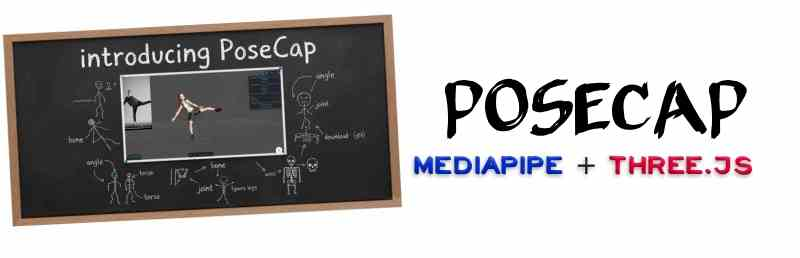

# [PoseCap](https://bandinopla.github.io/three-mediapipe-rig/?editor=posecap)

[PoseCap](https://bandinopla.github.io/three-mediapipe-rig/?editor=posecap) is a web application that allows you to capture and replay body movements captured using [Google MediaPipe](https://ai.google.dev/edge/mediapipe/solutions/guide) via your **webcam or a video file** and export the animation to a [Three.js](https://threejs.org/) skeletal rig in the form of a .glb file using the [GLTFExporter](https://threejs.org/docs/?q=exporter#GLTFExporter)

> The expected rig is a skeleton with bones named as the ones provided in the [rig.blend](https://github.com/bandinopla/three-mediapipe-rig/blob/main/rig.blend) file.

## Motivation
To be able to use the webcam to drive the animation of a skeleton in a web browser and save that recording as a re-usable animation clip!

## Demo
- [See a live demo](https://bandinopla.github.io/three-mediapipe-rig/?demo=bandinopla-chibi) using motion captured with PoseCap ( running a pre-recorded motion capture )

## Features

- Capture body movements using the MediaPipe Pose API ( _not perfect, depends on distance to camera and camera quality/resolution for best result_ )
- Replay captured movements
- Download captured movements as GLB files
- Upload custom models for animation
- Trim recorded animations ( _start/end times_ )

## Usage

1. Open the application in your browser
2. Click on "Webcam" or "Video File" to start capturing your movements
3. Open a .glb file containing a rig ( _not perfect, depends on distance to camera and camera quality/resolution for best result_ )
4. Click on "Record" to start recording
5. Click on "Stop" to stop recording
6. Click on "Play" to replay your movements
7. Click on "Download" to download your movements as a GLB file

You would then import the glb to your 3d software, extract the animation and assign it to your character's rig. Think on the exported .glb as a container for the animation only. It has a mesh, but it is stripped from all materials, the goal is to get the animations from it. 

## License

MIT