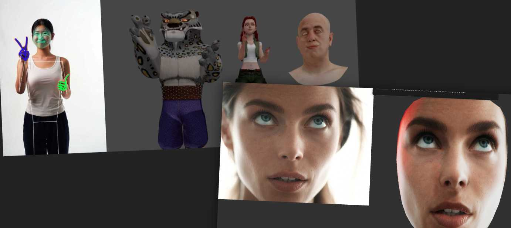

# Control a skeleton with the webcam

Integrate [Google MediaPipe](https://ai.google.dev/edge/mediapipe/solutions/guide)'s **webcam motion tracking** with [Three.js](https://threejs.org/) skeletal rigs. 

The motion from the webcam will be applied to a skeleton. Angle based so it works with any size skeleton. 

This will run 3 models: face, body, hands. So expect a FPS drop.

## Explore the demos:
- Open the [PoseCap Editor](https://github.com/bandinopla/three-mediapipe-rig/blob/main/POSECAP.md), examples using it:
	- [Bandinopla chibi](https://bandinopla.github.io/three-mediapipe-rig/?demo=bandinopla-chibi)  ( pose + face )
- Open the [MeshCap Editor](https://github.com/bandinopla/three-mediapipe-rig/blob/main/MESHCAP.md), examples using it:
	- [Loading .mcap files](https://bandinopla.github.io/three-mediapipe-rig/?demo=load-meshcap-files)
	- [Clips with Audio: Memory game](https://bandinopla.github.io/three-mediapipe-rig/?demo=game-youtubers)
- [Characters](https://bandinopla.github.io/three-mediapipe-rig)  ( pose + hands + face )
- [Hands Demo](https://bandinopla.github.io/three-mediapipe-rig/?demo=hands) ( pose + hands )
- [**Video to Face Geometry** !!](https://bandinopla.github.io/three-mediapipe-rig/?demo=face-uv)

---

## Table of Contents
- New! [**PoseCap Editor**](https://github.com/bandinopla/three-mediapipe-rig/blob/main/POSECAP.md)
- New! [**MeshCap Editor**](https://github.com/bandinopla/three-mediapipe-rig/blob/main/MESHCAP.md)
- [Features](#features)
- [Installation](#installation)
- [Quick Start](#quick-start)
  - [Skeleton](#skeleton)
  - [Facial Animation](#facial-animation)
- [API](#api)
  - [`setupTracker(config?)`](#setuptrackerconfig)
  - [Tracker API](#tracker-api-return-value-of-setuptracker)
- [Bone Naming](#bone-naming)
  - [Default bone names](#default-bone-names)
  - [Custom bone map example](#custom-bone-map-example)
- [Video -> Facial Geometry](#video-to-facial-geometry)
- [Multiple Characters](#multiple-characters)
- [Debugging with Video](#debugging-with-video)
- [Recording](#recording)
- [License](#license)

---

## Features

- **Full-body pose tracking** — shoulders, arms, hips, legs, and head
- **Hand tracking** — individual finger bones for both hands
- **Face tracking** — blendshape/morph target support for facial expressions and eye movement
- **Automatic bone binding** — maps MediaPipe landmarks to your rig's skeleton using a configurable bone-name map
- **Webcam & video input** — use a live webcam feed or a pre-recorded video for motion capture
- **Debug tools** — preview the video/image feed overlaid with landmark visualizations
- **Recording** — record the motion capture to a file ( .glb )

## Installation
```
npm install three-mediapipe-rig
```

> **Peer dependency:** [three](https://www.npmjs.com/package/three) `^0.182.0` and [mediapipe](https://www.npmjs.com/package/@mediapipe/tasks-vision) `^0.10.32` must be installed in your project.

## Quick Start

```ts 

// 1. Initialize the tracker (loads MediaPipe models)
await setupTracker({ ...config... })
 
const rig = scene.getObjectByName("rig")!;

// 2. Bind the rig to the tracker
const binding = tracker.bind(rig);
 

// 3. Start the webcam ( must be initialized by a user triggered event like a click )
button.addEventListener('click', () => {
    tracker.start(); //<-- will ask webcam access!
})


// 4. Update the rig in your render loop ( this keels the skeleton in-sync)
binding?.update(delta);
```

### Skeleton
You can use the skeleton provided in `rig.blend` or use your own and provide a bone name mapping so we know where the bones are in the second argument for the `.bind` method. But pay attention to the [**bone roll**](https://docs.blender.org/manual/en/latest/animation/armatures/bones/editing/bone_roll.html) of the provided skeleton, as it is the one expected by this module.

### Facial Animation
Media Pipe provides blend shape keys for the face ( estimated from the webcam ). The face it is expected to be a separated mesh with a name that starts with "face", with blend shape keys named as the ones provided by Media Pipe. See [Blend Shape Keys reference](/face-blendshapekeys.md) You don't have to have all of them, if they are not found, they will be ignored.


## API

### `setupTracker(config?)`

Initializes MediaPipe vision models and returns a tracker API object. This is an **async** function that downloads and loads the ML models.

```ts
const tracker = await setupTracker({
  ignoreLegs: true,
  displayScale: 0.2,
});
```

#### `TrackerConfig` options

| Option | Type | Default | Description |
|---|---|---|---|
| `ignoreLegs` | `boolean` | `false` | Skip leg tracking (useful for seated / upper-body-only characters) |
| `ignoreFace` | `boolean` | `false` | Skip face tracking entirely |
| `displayScale` | `number` | `1` | Scale of the debug video/canvas overlay |
| `debugVideo` | `string` | `undefined` | Path to a video file to use instead of the webcam |
| `debugFrame` | `string` | `undefined` | Path to a static image for single-frame debugging |
| `handsTrackerOptions` | `HandLandmarkerOptions` | `undefined` | Override [MediaPipe hand landmarker options](https://ai.google.dev/edge/mediapipe/solutions/vision/hand_landmarker/web_js#configuration_options) |
| `modelPaths` | `object` | *(CDN URLs)* | Custom URLs for the MediaPipe WASM & model files (see below) |

#### `modelPaths`

By default, models are loaded from Google's CDN. Override individual paths if you want to self-host the assets:

```ts
await setupTracker({
  modelPaths: {
    vision: "https://cdn.jsdelivr.net/npm/@mediapipe/tasks-vision@0.10.3/wasm",
    pose: "/models/pose_landmarker_lite.task",
    hand: "/models/hand_landmarker.task",
    face: "/models/face_landmarker.task",
  },
});
```

---

### Tracker API (return value of `setupTracker`)

The object returned by `setupTracker` exposes the following:

#### `tracker.start()` → `Promise<{ stop(): void }>`

Starts the webcam feed and begins real-time tracking. Returns a handle to stop the camera.

```ts
const camera = await tracker.start();

// Later, to stop:
camera.stop();
```

> Handles permission errors, missing cameras, and reconnection automatically with exponential backoff.

#### `tracker.bind(rig, boneMap?)` → `BindingHandler`

Binds a Three.js skeleton rig to the tracker. This is where the magic happens — it maps MediaPipe landmarks to your character's bones for **body**, **hands**, and **face** simultaneously.

```ts
const rig = gltf.scene.getObjectByName("rig")!;
const binding = tracker.bind(rig);
```

- **`rig`** — The root `Object3D` of your skeleton (the armature). It must contain child bones matching the expected naming convention.
- **`boneMap`** *(optional)* — A custom `BoneMap` object if your rig uses different bone names (see [Bone Naming](#bone-naming) below).

#### `BindingHandler.update(delta)`

Call this every frame in your render loop to apply the tracked motion to the bound rig. The `delta` parameter (in seconds) controls the interpolation smoothness.

```ts
renderer.setAnimationLoop((time) => {
  const delta = clock.update(time).getDelta();
  binding.update(delta);
  renderer.render(scene, camera);
});
```

#### `tracker.poseTracker` / `tracker.handsTracker` / `tracker.faceTracker`

Direct access to the individual sub-trackers if you need lower-level control. Each has a `.root` property (a `THREE.Object3D`) you can add to your scene for debugging landmark positions.

```ts
// Visualize the hand tracking landmarks in the 3D scene
scene.add(tracker.handsTracker.left.root);
```

---

## Bone Naming

The library uses a **default bone map** that expects specific bone names in your rig. If your model uses different names, pass a custom `BoneMap` to `tracker.bind()`.

> Check the skeleton at `rig.blend` for the expected bone names or append that rig to your project and use that as your skeleton.

### Default bone names

| Region | Bones |
|---|---|
| **Body** | `hips`, `torso`, `neck`, `head` |
| **Arms** | `upper_armL`, `forearmL`, `upper_armR`, `forearmR` |
| **Legs** | `thighL`, `shinL`, `footL`, `thighR`, `shinR`, `footR` |
| **Hands** | `handL`, `handR` |
| **Fingers (L/R)** | `index1L`–`index3L`, `middle1L`–`middle3L`, `ring1L`–`ring3L`, `pinky1L`–`pinky3L`, `thumb1L`–`thumb3L` *(same pattern for R)* |
| **Face** | Mesh named `face` (for blendshapes) |

### Custom bone map example

```ts
import type { BoneMap } from "three-mediapipe-rig";

// this tells the module what is the name of the expected bone.
const myBoneMap: BoneMap = {
  faceMesh: "Head_Mesh",
  head: "Head",
  hips: "Hips",
  neck: "Neck",
  torso: "Spine1",
  armL: "LeftArm",
  forearmL: "LeftForeArm",
  armR: "RightArm",
  forearmR: "RightForeArm",
  thighL: "LeftUpLeg",
  shinL: "LeftLeg",
  footL: "LeftFoot",
  thighR: "RightUpLeg",
  shinR: "RightLeg",
  footR: "RightFoot",
  handL: "LeftHand",
  handR: "RightHand",
  // ... finger bones ...
  index1L: "LeftHandIndex1",
  index2L: "LeftHandIndex2",
  index3L: "LeftHandIndex3",
  // (continue for all fingers)
};
```
 

## Video to Facial Geometry
Media Pipe's facial tracking also provides a facial mesh, if you [download the face mesh object](https://github.com/google-ai-edge/mediapipe/tree/master/mediapipe/modules/face_geometry) you can also make it deform and be textured using the webcam data. This will texture the mesh with the feed from the camera and also will move the vertices to adjust to the facial expressions:

```js
const face = tracker.faceTracker.bindGeometry( faceMesh );

//... and in your loop
face.update(delta)
``` 

### How does this work?
You use the canonical face model provided by media pipe ( this is important because it has the same number of vertices as the facial mesh ), this code will create a positionNode ( needs a NodeMaterial ) that will adjust the position of the vertices to match the facial mesh and also it will use the video feed as a texture for the mesh, so it will look like the face is deforming and moving with the webcam feed.

## Multiple Characters

You can bind **multiple rigs** to the same tracker. All of them will mirror the tracked motion:

```ts
const laraBinding = tracker.bind(laraRig);
const robotBinding = tracker.bind(robotRig);

renderer.setAnimationLoop((time) => {
  const delta = clock.update(time).getDelta();
  laraBinding.update(delta);
  robotBinding.update(delta);
  renderer.render(scene, camera);
});
```

---

## Debugging with Video

During development, use a pre-recorded video instead of a live webcam:

```ts
const tracker = await setupTracker({
  debugVideo: "test-video.mp4",
  displayScale: 0.2, // small overlay in the corner
});
```

Or test against a single frame:

```ts
const tracker = await setupTracker({
  debugFrame: "pose-reference.jpg",
  displayScale: 0.5,
});
```

## Recording
You can record the motion of a rig by doing this. Notice the track names of the clip will use the names of the bones from the currently recorded rig.

```ts
// Start recording
yourRigBindHandler.startRecording()

// after a while...
const result = yourRigBindHandler.stopRecording();

// to save the recording to a file....
result.saveToFile();

// or if you just want the AnimationClip...
result.clip
```
But this will save a .glb containing the rig (mesh, textures, etc...) You would have to strip the mesh data after export or just accept the full GLB and strip it with a post-process tool like [gltf-transform](https://gltf-transform.dev/). The saved .glb will contain the animation clip, the rig and the textures. Still havent figured out a way to export a minimal file like just the animation... 

--- 

## License

MIT
